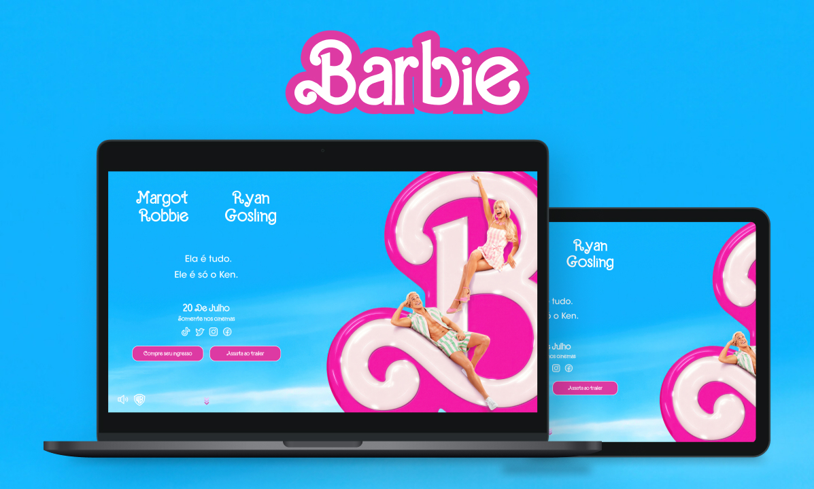

# Barbie Movie Website

Landing Page para o filme da Barbie.

## Stack utilizada

**Front-end:** HTML, CSS e Javascript.

**Outros:** Figma, Git e Github.

## Funcionalidades

- Assistir ao trailer oficial do filme;
- Áudio interativo, onde o usuário pode escutar o tema da Barbie.

## Deploy

Acesse a demo do site [clicando aqui](https://gusales.github.io/barbie-movie-website/).

## Referência

- [Canal Sujeito Programador, idealizador do projeto](https://www.youtube.com/@birobirobiro)
- [Link do vídeo](https://www.youtube.com/watch?v=H2bGF2pwu5k&t=284s&ab_channel=birobirobiro)
